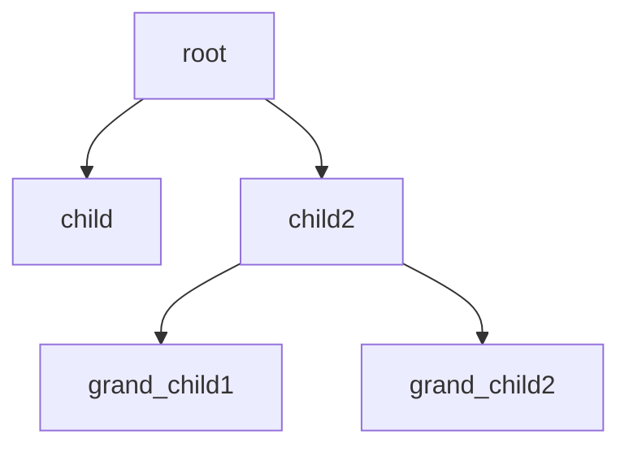

<p align="center">
  <picture>
    
  </picture>
  <br/>

  <sub>
    8-bit Ferris by <a href="https://users.rust-lang.org/t/ferris-as-an-8-bit-sprite/25346">YakoYakoYokuYoku & ryanobeirne</a>
  </sub>
  <br/>
</p>

 <p align="center">
    <a href="https://github.com/LVivona/canopy/blob/main/LICENCE.md"></a>

</p>


Canopy is a small tree-based data structure implemented in Rust. It provides a way to model hierarchical relationships with two types of nodes: `Node::Parent` and `Node::Leaf`. The structure is defined as follows:

```rust
enum Node<T> {
    Leaf {
        prev: Option<PrevNodeRef<T>>,
        value: T,
    },
    Parent {
        value: T,
        prev: Option<PrevNodeRef<T>>,
        next: Vec<NodeRef<T>>,
    },
}
```

- **`Node::Parent`** nodes hold references to their children and optionally to their parents, along with their value.
- **`Node::Leaf`** nodes store just a value and do not have any children, making them terminal points in the tree structure. However, leaf nodes may also be able to be upgraded to **`Node::Parents`** allowing them to have children.
  - std library feature where ``PrevNodeRef``, is ``Weak<RefCell<T>>`` while `no_std` uses `rclite::Rc<RefCell<T>>`.

Canopy uses Rust’s pattern within to enable shared mutability and ownership, which makes it well-suited for managing dynamic, tree-like data.

## Quick Tour



To quickly get acquainted with the interface, let's create a simple graph structure like the one above. We'll also demonstrate some basic operations available in `canopy`.

### **Insert**
To build our structure, we start by instantiating the parent node using `Node::parent()`. This function returns a reference-counted `Node::Parent`.

To add children, we pass a reference to the parent node and the value we want to insert. This rule applies recursively to all descendants.

```rust
use canopy::{Node, NodeRef, error::NodeError};

fn main() -> Result<(), NodeError> {
    let root: NodeRef<u8> = Node::parent(1);
    
    // `child` is now a Node::Leaf that points to `root`.
    let child: NodeRef<u8> = Node::insert(&root, 2)?;
    // `child2` is now a Node::Leaf that points to `root`.
    let child2: NodeRef<u8> = Node::insert(&root, 3)?;

    // `child2` is upgraded to Node::Parent that points to `root`,
    // and has `grand_child1` as a child.
    let grand_child1: NodeRef<u8> = Node::insert(&child2, 4)?;
    // `grand_child2` is added as another child of `child2`.
    let grand_child2: NodeRef<u8> = Node::insert(&child2, 5)?;
    
    Ok(())
}
```

### **Pop**
The `pop` operation removes a child node from its parent. If all children are removed, the parent node is downgraded back to a `Node::Leaf`.

```rust
fn main() -> Result<(), NodeError> {
    // Assume nodes are created as shown in the previous example.
    
    Node::pop(&child2, &grand_child1)?;
    Node::pop(&child2, &grand_child2)?;
    
    // Both children of `child2` have been removed,
    // so `child2` downgrades back to a `Node::Leaf`.
    
    Ok(())
}
```

### **Iterate**
We can iterate over the nodes using `Node::iter()`. This allows us to traverse the tree structure.

```rust
use canopy::{Node, NodeRef, NodeIter};

fn main() -> Result<(), NodeError> {
    let root: NodeRef<u8> = Node::parent(1);
    let child: NodeRef<u8> = Node::insert(&root, 2)?;
    let child2: NodeRef<u8> = Node::insert(&root, 3)?;
    let grand_child1: NodeRef<u8> = Node::insert(&child2, 4)?;
    let grand_child2: NodeRef<u8> = Node::insert(&child2, 5)?;

    let mut nodes: NodeIter<u8> = Node::iter(root.clone());
    while let Some(node) = nodes.next() {
        // order printed out: 1, 2, 3, 4, 5
        println!("{}", node.borrow().value());
    }
    
    Ok(())
}
```

## Features

- Tree-based structure with mutable and shared ownership via `Rc<RefCell<T>>`, and `Weak<RefCell<T>>`.
- Ability to model both parent-child relationships.
- Safety-focused code development, on trying to adhering to the "Power of 10" rules for safety-critical systems.
- Iter though using a BFS data-type `NodeIter<T>`
- Supports `#[no_std]`

## Installation

To use Canopy in your project, add it to your `Cargo.toml`:

```toml
[dependencies]
canopy = { git = "https://github.com/LVivona/canopy", branch = "main" }

```

### Closing Remarks

This project is also a personal experiment to apply best practices in developing safety-critical code. By adhering to the "Power of 10" rules for writing safe and reliable systems, the goal is to create robust, memory-safe code while exploring the depths of Rust’s safety features.
