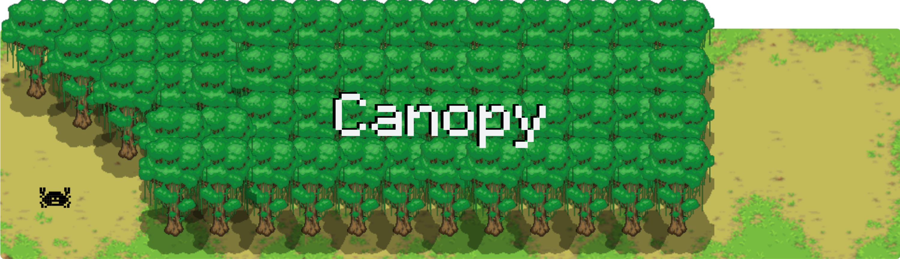

<h1>Canopy</h1>

<p align="center">
  <picture>
    
  </picture>
  <br/>

  <sub>
    8-bit Ferris by <a href="https://users.rust-lang.org/t/ferris-as-an-8-bit-sprite/25346">YakoYakoYokuYoku & ryanobeirne</a>
  </sub>
  <br/>
</p>

 <p align="center">
    <a href="https://github.com/LVivona/canopy/blob/main/LICENCE.md"></a>

</p>

Canopy is a small tree-based data structure implemented in Rust. It provides a way to model hierarchical relationships with two types of nodes: `Node::Parent` and `Node::Leaf`. The structure is defined as follows:

```rust
enum Node<T> {
    Leaf {
        prev: Option<NodeRef<T>>,
        value: T,
    },
    Parent {
        value: T,
        prev: Option<NodeRef<T>>,
        next: Vec<NodeRef<T>>,
    },
}
```

- **`Node::Parent`** nodes hold references to their children and optionally to their parents, along with their own value.
- **`Node::Leaf`** nodes store just a value and do not have any children, making them terminal points in the tree structure. Though leaf nodes may also be able to be upgraded to **`Node::Parents`** allowing them to have children.

Canopy uses Rust’s `Rc<RefCell<T>>` pattern to enable shared mutability and ownership, which makes it well-suited for managing dynamic, tree-like data.

## Features

- Tree-based structure with mutable and shared ownership via `Rc<RefCell<T>>`.
- Ability to model both parent-child relationships and isolated leaf nodes.
- Safety-focused code development, adhering to the "Power of 10" rules for safety-critical systems.

### Future Features

- [ ] Implement tracing
- [ ] Support `#[no_std]`
- [ ] Implement `Box` pattern
- [ ] Iter

## Installation

To use Canopy in your project, add it to your `Cargo.toml`:

```toml
[dependencies]
canopy = { git = "https://github.com/LVivona/canopy", branch = "main" }

```

## Example

```rust
use canopy::{Node, NodeRef};

let root = Node::Parent(1)
let child = Node::insert(&root, 2);
let child2 = Node::insert(&root, 3);
```

### Closing Remarks

This project is also a personal experiment to apply best practices in developing safety-critical code. By adhering to the "Power of 10" rules for writing safe and reliable systems, the goal is to create robust, memory-safe code while exploring the depths of Rust’s safety features.
